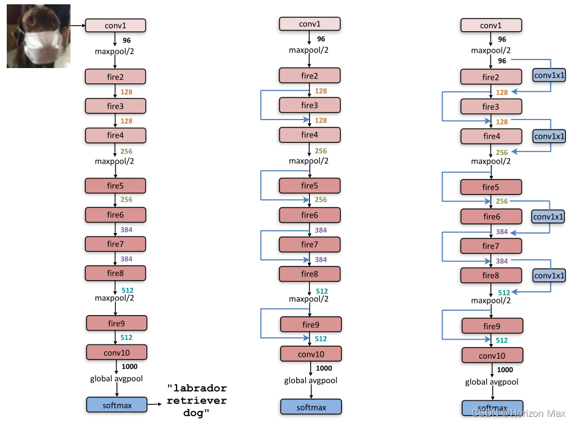

# SqueezeNet

## brief

SqueezeNet 在 ImageNet 上实现与 AlexNet 同等级别的精度，但参数少了 50 倍

系统架构如下：



模型参数量如下：

```
----------------------------------------------------------------------------
           Layer (type)        Output Shape         Param #     Tr. Param #
============================================================================
               Conv2d-1     [1, 64, 13, 13]             640             640
                 ReLU-2     [1, 64, 13, 13]               0               0
            MaxPool2d-3       [1, 64, 6, 6]               0               0
                 Fire-4      [1, 128, 6, 6]          11,408          11,408
                 Fire-5      [1, 128, 6, 6]          12,432          12,432
            MaxPool2d-6      [1, 128, 3, 3]               0               0
                 Fire-7      [1, 256, 3, 3]          45,344          45,344
                 Fire-8      [1, 256, 3, 3]          49,440          49,440
            MaxPool2d-9      [1, 256, 1, 1]               0               0
                Fire-10      [1, 384, 1, 1]         104,880         104,880
                Fire-11      [1, 384, 1, 1]         111,024         111,024
                Fire-12      [1, 512, 1, 1]         188,992         188,992
                Fire-13      [1, 512, 1, 1]         197,184         197,184
             Dropout-14      [1, 512, 1, 1]               0               0
              Conv2d-15     [1, 1000, 1, 1]         513,000         513,000
                ReLU-16     [1, 1000, 1, 1]               0               0
   AdaptiveAvgPool2d-17     [1, 1000, 1, 1]               0               0
============================================================================
Total params: 1,234,344
Trainable params: 1,234,344
Non-trainable params: 0
----------------------------------------------------------------------------
```

本模型训练集使用 FashionMNIST ，对网络结构做了部分调整，详见代码

训练 100 轮的情况下，准确率最高可达 90%
